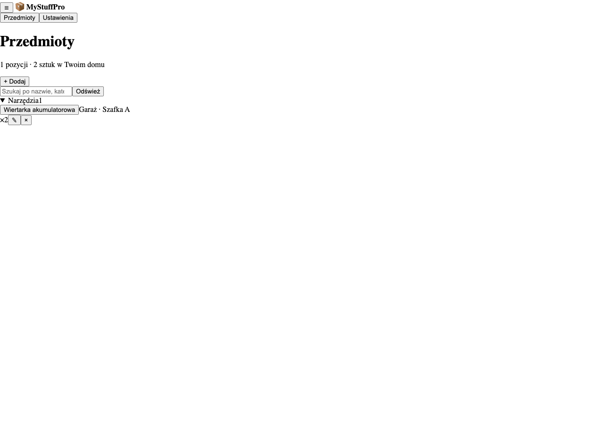

# MyStuffPro

Samodzielny domowy inwentarz dla Home Assistant **2026.9.x**, oparty na stronie „Mój Inwentarz”. Nie wymaga PHP, osobnego serwera ani dostępu do chmury. Interfejs panelu jest po polsku.

## Instalacja przez HACS

1. W HACS otwórz menu → **Repozytoria niestandardowe**.
2. Dodaj `https://github.com/robertmierzwinski/MyStuffPro` w kategorii **Integracja**.
3. Wyszukaj **MyStuffPro**, pobierz integrację i uruchom ponownie Home Assistant.
4. Dodaj **MyStuffPro** w **Ustawienia → Urządzenia i usługi → Dodaj integrację**.

Instalacja przez HACS i poprawne działanie zostały potwierdzone przez użytkownika.
Aktualizacje instaluj przez HACS, a następnie restartuj Home Assistant. W razie starego wyglądu panelu odśwież przeglądarkę. Dane pozostają w `.storage/mystuffpro`.

## Podgląd

## Wersje

Zmiany opisuje [CHANGELOG.md](CHANGELOG.md). Wydania znajdują się na stronie [GitHub Releases](https://github.com/robertmierzwinski/MyStuffPro/releases).

## Instalacja ręczna

1. Pobierz archiwum źródeł wybranego wydania z GitHub Releases (lub **Code → Download ZIP**) i rozpakuj je.
2. Skopiuj katalog `custom_components/mystuffpro` do `/config/custom_components/mystuffpro` w Home Assistant. Plik `manifest.json` musi znajdować się bezpośrednio w tym katalogu.
3. Uruchom ponownie Home Assistant.
4. Otwórz **Ustawienia → Urządzenia i usługi → Dodaj integrację**, wyszukaj **MyStuffPro** i zatwierdź.
5. Otwórz **MyStuffPro** w menu bocznym. Jeśli po instalacji panel się nie pojawia, odśwież stronę lub uruchom ponownie aplikację Companion.

Nie dodawaj wpisu do `configuration.yaml` ani zasobów Lovelace. Integracja sama rejestruje panel i pliki interfejsu.

## Funkcje

- Dodawanie, edycja i usuwanie przedmiotów z potwierdzeniem.
- Nazwa, kategoria, lokalizacja, podlokalizacja, ilość, opis i data dodania.
- Grupowanie według kategorii, podpowiedzi z istniejących danych i wyszukiwanie, również po opisie.
- Jasny i ciemny motyw lub dopasowanie do Home Assistant. Wybór jest zapamiętywany w danej przeglądarce.
- Responsywny panel na telefon i komputer, z przyciskiem otwierającym menu HA.
- Eksport JSON oraz import starego `data/items.json` i kopii MyStuffPro.
- Cztery sensory: liczba pozycji, suma ilości, liczba niepustych kategorii i liczba niepustych lokalizacji.
- Wspólny inwentarz dla zalogowanych użytkowników. Wszyscy mogą przeglądać, eksportować i edytować przedmioty; import jest dostępny tylko administratorom.

## Przeniesienie danych ze strony

Na starej stronie pobierz eksport JSON albo skopiuj `data/items.json`. W panelu MyStuffPro wybierz **Ustawienia → Import danych** i wskaż plik. Domyślnie przedmioty są dopisywane. Opcja „Zastąp cały inwentarz” usuwa bieżącą zawartość dopiero po zatwierdzeniu i poprawnej walidacji całego pliku. Przed zastąpieniem wyeksportuj bieżące dane.

Import zachowuje pola i daty, ale przydziela nowe identyfikatory. Ponowny import tego samego pliku dopisuje duplikaty. Limit: 10 000 pozycji, ilość 1–1 000 000, plik importowany w panelu do 5 MB. Nieprawidłowy plik nie jest importowany częściowo. Źródłowy plik strony nie jest modyfikowany i nie jest dołączony do paczki integracji.

## Zapis i współpraca urządzeń

Dane zapisuje Home Assistant w `/config/.storage/mystuffpro`. Zapis jest realizowany przez mechanizm `Store` HA. Dane powinny być objęte kopią zapasową konfiguracji HA; dodatkowo można wyeksportować JSON. Nie edytuj ręcznie pliku podczas działania integracji. Wyłączenie lub usunięcie wpisu integracji zachowuje dane, aby można było dodać ją ponownie bez ich utraty.

Lista odświeża się co 10 sekund, gdy jest otwarta. Formularz nie jest odświeżany podczas edycji. Jeśli ktoś w tym czasie zapisze zmianę, zapis nieaktualnego formularza zostanie odrzucony z komunikatem. Zanotuj własne zmiany, anuluj formularz, odśwież listę i ponów edycję. Nie ma trybu edycji offline.

## Status weryfikacji

Wersja **1.0.1**: przygotowanie dystrybucji HACS. API rejestracji panelu i WebSocket sprawdzono w kodzie HA **2026.9.0**. Sprawdzono składnię Python/JavaScript/JSON, 10 testów walidacji i zapisu oraz panel w przeglądarce z symulowanym połączeniem HA. Użytkownik potwierdził poprawne działanie integracji na swojej instalacji Home Assistant. Pełny automatyczny test integracyjny HA nie był wykonywany w środowisku deweloperskim.

Testy Python: `python3 -m unittest discover -s tests -v`. Test przeglądarkowy `tests/frontend.cjs` wymaga Playwright i Chrome; ścieżki można ustawić przez `PLAYWRIGHT_MODULE` i `CHROME_EXECUTABLE`.

Struktura repozytorium i `hacs.json` są przygotowane pod dystrybucję jako repozytorium niestandardowe HACS. Integracja nie znajduje się w domyślnym katalogu HACS. Wyniki walidacji HACS, hassfest i testów są dostępne w zakładce **Actions** repozytorium.

## Źródła API

- [Panel w Home Assistant 2026.9.0](https://github.com/home-assistant/core/blob/2026.9.0/homeassistant/components/panel_custom/__init__.py)
- [WebSocket w Home Assistant 2026.9.0](https://github.com/home-assistant/core/blob/2026.9.0/homeassistant/components/websocket_api/decorators.py)
- [Asynchroniczna rejestracja plików panelu](https://developers.home-assistant.io/blog/2024/06/18/async_register_static_paths/)

## Licencja

Projekt jest udostępniany na licencji [GNU GPL v3.0](LICENSE).
